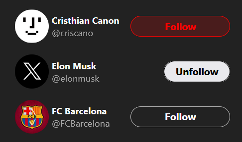

# X Follow Card [Link](link)

This react application is made of and reviews react topic as components, functions, props, hooks (useState).

## Overview
Works similarly as X Card when X recommends you some account to follow. This application handle onclick function to update button inner content, style and update it dinamically via useState hook.

