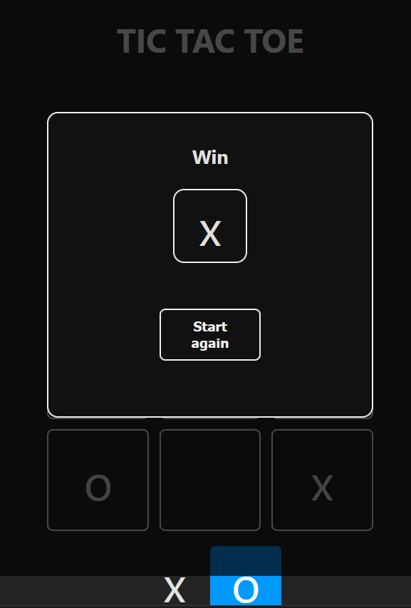
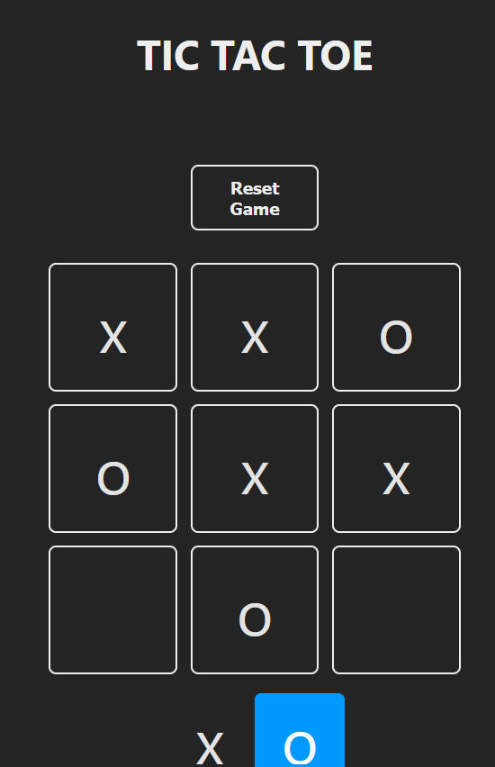
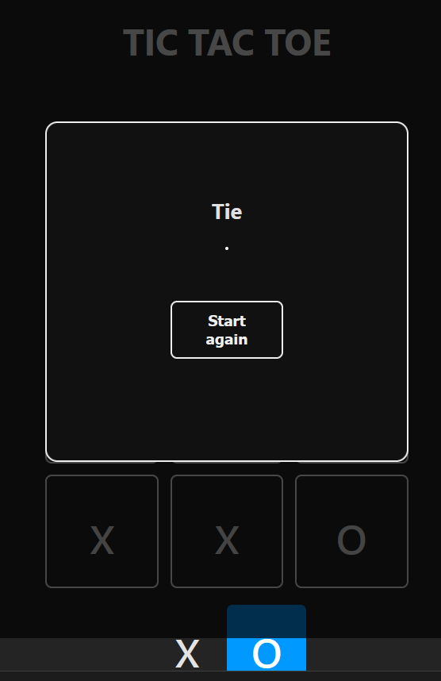

# TIC TAC TOE [Link](websitelink)

This react application is made of react topic as components, functions, props, hooks (useState), localStorage, terniary usage, array manipulation, among other functionalities.

## Overview
Recreation of a Tic Tac Toe game.  
Once a square is clicked, the inner value is updated and the turn changes.
It detects if there is a winner (if a player get 3 of marks in a row) or not.
It will notify who has won or not and a button to reset game. 
By using localStorage, it will keep the current grid game status via storing in the DOM.

### Game snapshots

  
  
  

